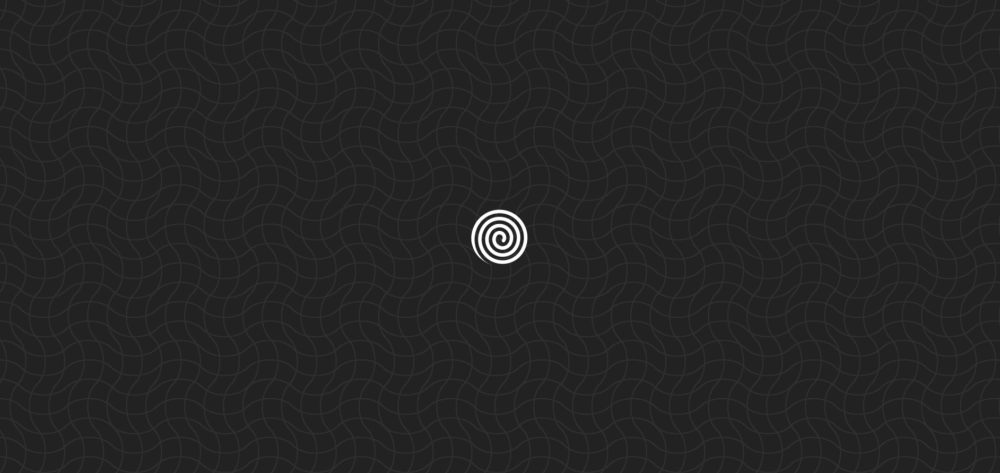
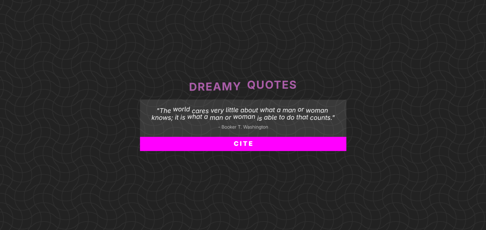

# D R E A M Y - Q U O T E S


Una aplicación web que muestra **citas inspiradoras** con animaciones.
Cada clic en **"CITA"** trae una nueva frase y se anima usando GSAP.

## Instalación

**No se requiere servidor!** puedes abrir _**'public/index.html'**_ en tu navegador

```bash
git clone https://github.com/bugged-code/dreamy-quotes.git
cd dreamy-quotes
pnpm install # npm install or yarn install
pnpm dev
```

## Screenshots

<div style="display:flex;flex-wrap:wrap;justify-content:center;gap:24px">
  
  
</div>
